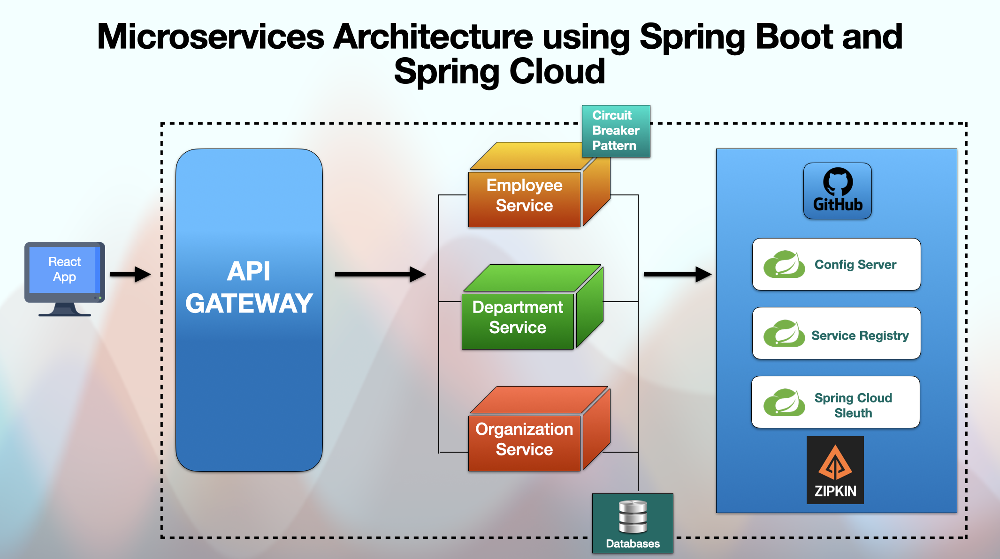

# springboot-microservices

# Microservices with Springboot and Spring Cloud.

<p align="center">
  
</p>

> Status of Project: Under development :wrench::hammer:

## Description of Project

Example of Microservices about a Employees Manageament and organizations. 

## Functionalities

:bell: RESTful web services using Spring Boot.

:bell: CRUD REST APIs using Spring Boot, Spring Data JPA, and MySQL Database. 

:bell: Microservices Communication using Spring Cloud OpenFeign.

:bell: Service Registry and Discovery using Spring Cloud Netflix Eureka.

:bell: Load balancing with Eureka server and Open Feign using Spring Cloud LoadBalancer.

:bell: API Gateway using Spring Cloud Gateway.

:bell: Centralized Configurations using Spring Cloud Config Server.

:bell: Auto Refresh Config Changes using Spring Cloud Bus.

:bell: Distributed Tracing with Spring Cloud Sleuth and Zipkin.

:bell: Resilience4J: Circuit Breaker, Retry, and RateLimiter Patterns.

:bell: Test the application with a simple React Frontend and Integrate with Backend Microservices.


## Tools and technologies used:
  1. Java 17+

  2. Spring boot

  3. Spring Cloud

  4. Microservices

  5. React

  6. Resilience4J framework

  7. Maven

  8. IntelliJ IDEA

  9. MySQL database

  10. Postman

  11. RabbitMQ

  12. Docker (in progress)

## Local Ports Mapping of the Project:
```bash
App name: API-GATEWAY - Port: 9191
App name: DEPARTMENT-SERVICE - Ports: 8080, 8082 
App name: EMPLOYEE-SERVICE - Port: 8081
App name: CONFIG-SERVER - Port: 8888 External Repo https://github.com/SergioRuyDev/config-server-repo.git
App name: SERVER-REGISTRY - Port: 8761
App name: ORGANIZATION-SERVICE - Port: 8083
App name: REACT-FRONTEND - Port: 3000
Zipkin Server: 9411
```
## Steps and Requirements to build and run the Project

** DOCKERIZATION IN PROGRESS, ONCE DONE, I WILL UPDATE THIS README. 

